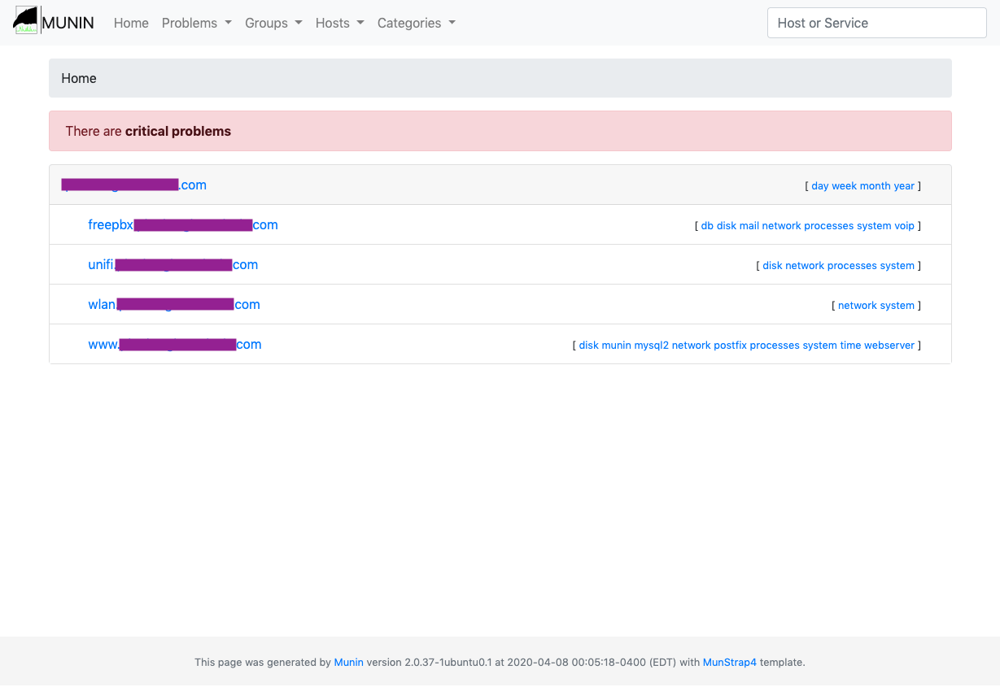
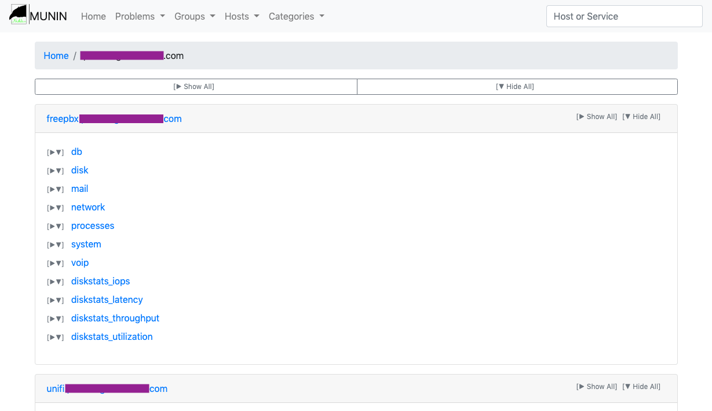
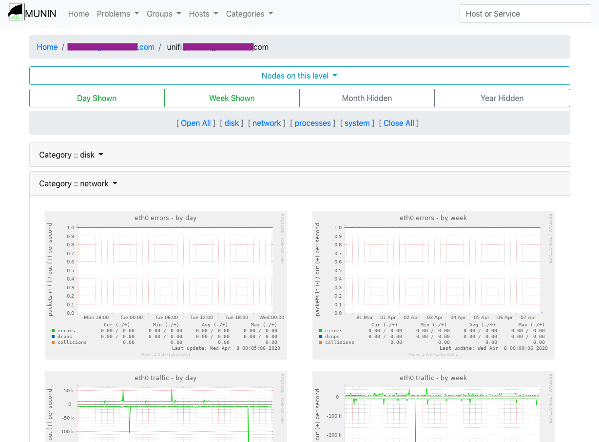
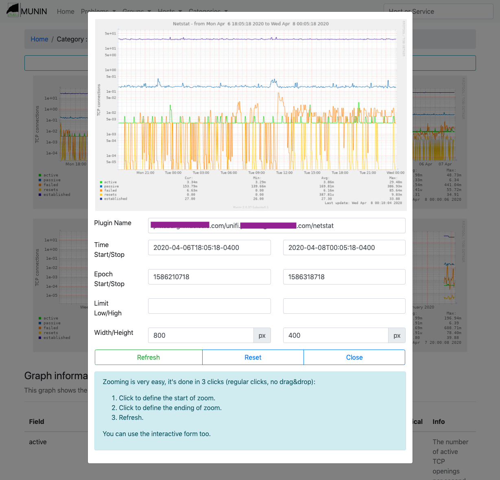

Munstrap4
=========

Alternative Munin 2.x templates based on Twitter Bootstrap 4.

Based on "Munstrap" by [Jonny McCullagh](https://github.com/jonnymccullagh), [munin-monitoring/contrib](https://github.com/munin-monitoring/contrib) repo.



[Semi-Live Demo](https://jtsage.dev/munin-demo/) - Zoom functionality for this demo has been disabled, and the data will never update, but it's a decent visual reference.

Installation
------------

Clone the munin-monitoring/contrib repo to a temporary location:

```
cd /opt
git clone https://github.com/munin-monitoring/contrib.git
```

Replace the Munin stock template with Munstrap (Shown is backing up the stock template first):

```
cd /etc/munin
mv templates templates.stock
mv static static.stock 
cp -r /opt/contrib/templates/munstrap4/templates .
cp -r /opt/contrib/templates/munstrap4/static .
```

Clean the old generated files (this location may differ - check /etc/munin/munin.conf for the "htmldir")

```
rm -rf /var/www/munin/*
```

Take a coffee and wait some minutes for the html generation by Munin.

Revert to Official Munin Template
---------------------------------

```
cd /etc/munin
rm -rf templates static
mv templates.stock templates
mv static.stock static
```

Samples
-------
View of a group:


View of a specific node:


Zoom feature:



Compatibility
-------------
a/n: I am unsure of the compatibility with the next major version of munin. Most things will work
from what I've read, but the navigation may be slightly funky.